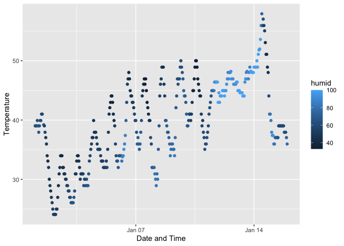

p8105_hw1_ht2630
================
Haotian Tang
2023-09-23

This is homework 1.

------------------------------------------------------------------------

Problem 1

``` r
library(moderndive)

data("early_january_weather")

?early_january_weather

weather = early_january_weather

colnames(weather)
```

    ##  [1] "origin"     "year"       "month"      "day"        "hour"      
    ##  [6] "temp"       "dewp"       "humid"      "wind_dir"   "wind_speed"
    ## [11] "wind_gust"  "precip"     "pressure"   "visib"      "time_hour"

``` r
ncol(weather)
```

    ## [1] 15

``` r
nrow(weather)
```

    ## [1] 358

``` r
temp = weather$temp

mean(temp)
```

    ## [1] 39.58212

``` r
library(tidyverse)
```

    ## ── Attaching core tidyverse packages ──────────────────────── tidyverse 2.0.0 ──
    ## ✔ dplyr     1.1.2     ✔ readr     2.1.4
    ## ✔ forcats   1.0.0     ✔ stringr   1.5.0
    ## ✔ ggplot2   3.4.3     ✔ tibble    3.2.1
    ## ✔ lubridate 1.9.2     ✔ tidyr     1.3.0
    ## ✔ purrr     1.0.2     
    ## ── Conflicts ────────────────────────────────────────── tidyverse_conflicts() ──
    ## ✖ dplyr::filter() masks stats::filter()
    ## ✖ dplyr::lag()    masks stats::lag()
    ## ℹ Use the conflicted package (<http://conflicted.r-lib.org/>) to force all conflicts to become errors

``` r
time_hour = weather$time_hour

ggplot(weather, 
       aes(x = time_hour, y = temp, color = humid)) + 
  geom_point() +
  xlab("Date and Time") + 
  ylab("Temperature")
```

<!-- -->

``` r
ggsave("p8105_hw1_ht2630_ggplot.jpg")
```

    ## Saving 7 x 5 in image

We can see there are 15 columns and 358 rows. The variables are shown in
the first result.

According to the section of “Help”,

“temp” is the temperature.

“dewp” is the dew point.

“wind_dir”, “wind_speed”, and “wind_gust” are wind derection, speed and
gust speed.

“precip” is the precipitation.

“visib” is the visibility.

“time_hour” is the data and hour of recording.

The last section shows the mean temperature is 39.58212.

The ggplot shows that temperature has some fluctuation across the time
but a increasing trend is observed.

------------------------------------------------------------------------

Problem 2

``` r
data_frame = tibble(
  random_sample = rnorm(10), 
  logical_vector = random_sample > 0,
  character_vector = c("a", "b", "c", "d", "e", "f", "g", "h", "i", "j"),
  factor_vector = factor(c("Level1", "Level1", "Level1", "Level2", "Level2", "Level2", "Level3", "Level3", "Level3", "Level3"))
)

mean(pull(data_frame, random_sample))
```

    ## [1] 0.1204876

``` r
mean(pull(data_frame, logical_vector))
```

    ## [1] 0.6

``` r
mean(pull(data_frame, character_vector))
```

    ## Warning in mean.default(pull(data_frame, character_vector)): argument is not
    ## numeric or logical: returning NA

    ## [1] NA

``` r
mean(pull(data_frame, factor_vector))
```

    ## Warning in mean.default(pull(data_frame, factor_vector)): argument is not
    ## numeric or logical: returning NA

    ## [1] NA

    ## Warning: NAs introduced by coercion

Thus, we can find that we can take means from the random sample and
logical vector,

but not from character vector and factor vector.

When we use as.numeric function to the last three vectors,

we can find the logical vector shows 1 and 0, which explains why it has
mean.

The mean is just the frequency of TRUE.

The as.numeric function of character vector shows NA,

so it is not numeric and it does not have mean.

However, we can find the as.numeric function of the factor vector shows
1, 2, and 3,

which does not why the factor vector does not have mean.

Therefore, it partially explains which of them have the mean.
